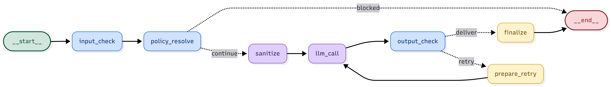

# GuardRail-OS — LLM Safety & Compliance Gateway

An OpenAI-compatible proxy that sits between any application and any LLM provider and
applies a multi-layer guardrail stack — input classification, policy resolution, PII
handling, and output safety checks — without requiring any change to application code.
Point an app's `POST /v1/chat/completions` at the gateway and it forwards to the LLM
(Gemini here) with safety enforced invisibly in between.

This document is written for an engineer picking up the system. It covers the
architecture, the measured performance, the design decisions and their tradeoffs, and
the known limitations.

---

## Architecture

Every request flows through an explicit LangGraph state machine:



**Input layer.** A fine-tuned DeBERTa-v3 classifier (exported to ONNX) scores each
prompt across four labels — `prompt_injection`, `jailbreak`, `pii_present`,
`policy_violation` — each with its own threshold. This is a discriminative classifier,
not a prompted LLM: it runs in ~12ms with no token cost.

**Policy engine (dual-path GraphRAG).** Fired labels and the prompt text are resolved
against a policy graph:
- *Entity path* — a hard lookup from each classifier label to its policies (keyword-gated
  where applicable). Guaranteed and compliance-critical.
- *Semantic path* — the prompt is embedded (ChromaDB, ONNX MiniLM) and matched to policies
  by meaning, gated by a distance threshold. Catches policies the classifier has no label
  for (e.g. GDPR right-to-erasure).

Both anchor sets are unioned and expanded up a NetworkX graph (leaf → domain →
regulation) to produce the full governing-regulation set. A priority resolver then picks
the winning action and logs any conflict (two policies specifying different actions). The
decision is BLOCK / SANITIZE / PASS, and every block carries a full audit chain
(`leaf > domain > regulation`) in the response headers.

**Output layer.** The buffered LLM response is checked for toxicity (Detoxify), schema
conformance (Pydantic, when the caller requests JSON with required fields), and
prompt-response consistency (embedding cosine, a lightweight hallucination proxy). On
failure the pipeline reformulates with an explicit safety instruction and retries (up to
2×), falling back to a safe canned response if it still fails.

---

## Measured performance

**Classifier (held-out test set, 14,162 examples):**

| Label | F1 |
|---|---|
| Prompt injection | 0.993 |
| PII presence | 0.997 |
| Policy violation | 0.919 |
| Jailbreak | 0.789 |
| **Macro F1** | **0.925** |

Trained on ~142K examples (HackAPrompt, WildGuard, Jigsaw Civil Comments, ai4privacy),
80/10/10 split, DeBERTa-v3-base + LoRA (r=8, α=16, adapters on query/value projections),
multi-label BCE with class weighting for imbalance.

**Inference latency (ONNX Runtime, FP32):**

| Provider | Mean | P95 |
|---|---|---|
| CUDA (T4 GPU) | 11.7ms | 18.0ms |
| CPU | 1585ms | 2510ms |

ONNX Runtime on GPU is ~135× faster than CPU — this is the optimization that makes a
per-request safety classifier viable at scale.

**Gateway (52-case adversarial regression suite):**

- Block recall: **100%** (no adversarial prompt leaked)
- False-positive rate: **~4%** after tuning the `policy_violation` threshold (0.3 → 0.6,
  which removed 3 of 4 false positives with no change to block recall)
- Exact decision accuracy: **90.4%**

---

## Design decisions (and their tradeoffs)

**Classifier, not a prompted LLM, for input safety.** A prompted safety check adds
400–800ms and token cost per request; the DeBERTa classifier is ~12ms and free. The
tradeoff: it is fixed to its trained categories and cannot reason about novel phrasings —
which is why the system pairs it with the semantic policy path.

**GraphRAG, not flat vector search, for policies.** Flat search returns the nearest
policy document but cannot traverse the hierarchy, so the governing regulation never
appears in the audit trail. The graph makes `leaf → domain → regulation` fall out of
traversal, supports multi-parent domains (e.g. `pii-protection` under both GDPR and
PCI-DSS), and enables priority-based conflict resolution. Honest caveat: for a small
policy set, parent pointers would traverse the same hierarchy; the graph earns its place
as the policy set grows and gains DAG relationships.

**Dual-path retrieval.** The entity path guarantees coverage on trained categories; the
semantic path covers intents with no trained label. Neither alone handles all cases — the
right-to-erasure example is caught only by the semantic path, and the union is stronger
than either.

**LangGraph for orchestration.** The block/sanitize/pass branch is a conditional edge and
the output retry is a cycle — both are first-class in LangGraph and awkward as nested
loops with manual state. Honest caveat: for a mostly-linear pipeline this is more
machinery than strictly required; its payoff is explicit state, the clean retry cycle, and
per-node observability.

**Output guardrails run after buffering, not streaming.** Toxicity, schema, and
consistency checks all need the complete response. Buffering is the correct v1 tradeoff;
streaming inspection is future work.

---

## Known limitations (honest)

- **Jailbreak is the weakest class (0.79 F1, 0.66 precision).** It overlaps semantically
  with `policy_violation` because both draw partly from the same data; classic persona
  jailbreaks sometimes route to `policy_violation` instead. At the system level they are
  still blocked, but per-label separation is imperfect. Fix: augment with more diverse
  jailbreak templates and tighten the label taxonomy.
- **Attack meta-discussion is conflated with attacks.** "Translate X then…" phrasing and
  security-education prompts can trip the injection label, because the model cannot
  distinguish *using* an attack from *asking about* one. Fix: contrastive training data
  with educational examples labeled benign.
- **Consistency scoring is a coarse proxy.** It flags gross topic drift but structured
  outputs (JSON) sit near the threshold; it is treated as a soft signal, not a hard gate.
- The model is served FP32 (not quantized); the latency win comes from ONNX Runtime + GPU.

---

## Running it

```bash
pip install -r requirements.txt
# set GEMINI_API_KEY and DEFAULT_MODEL in .env
uvicorn app.main:app --port 8000
```

Run the regression suite:

```bash
python -m pytest -s tests/test_guardrails.py
```

Adding a policy is a YAML file in `config/policies/` (id, domain, regulation, action,
priority, triggers) — no code change.

---

## Stack

DeBERTa-v3 + LoRA + ONNX Runtime (classifier) · FastAPI (gateway) · LangGraph
(orchestration) · ChromaDB + NetworkX (dual-path policy engine) · Detoxify + Pydantic
(output guardrails) · Gemini (LLM) · pytest (regression suite).
